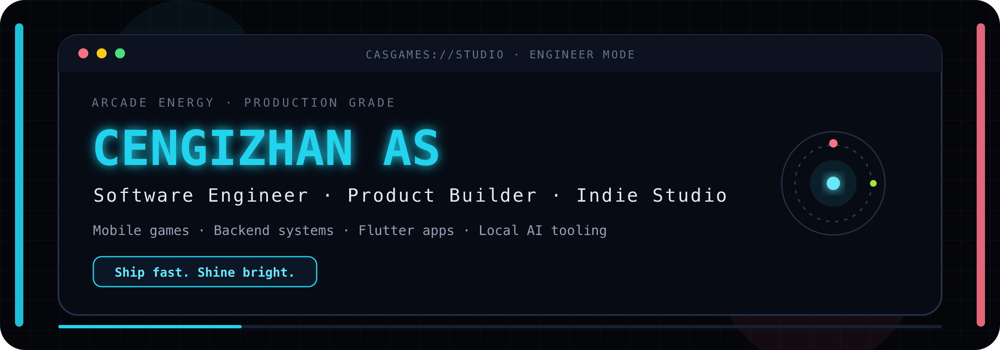
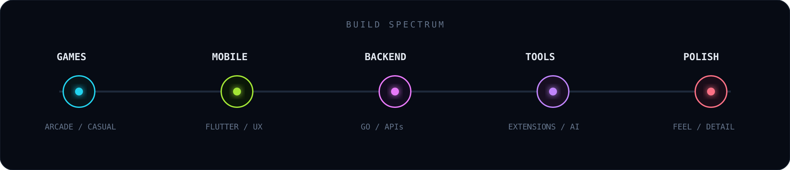
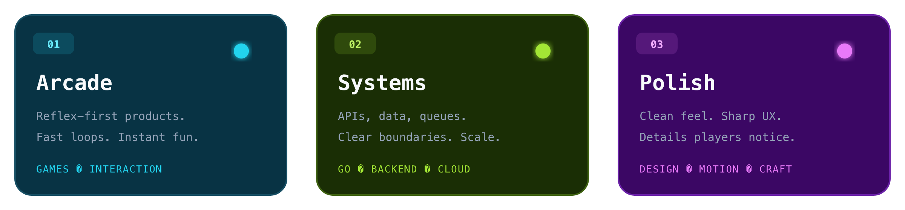
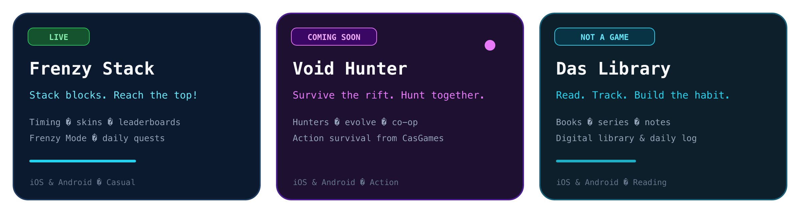
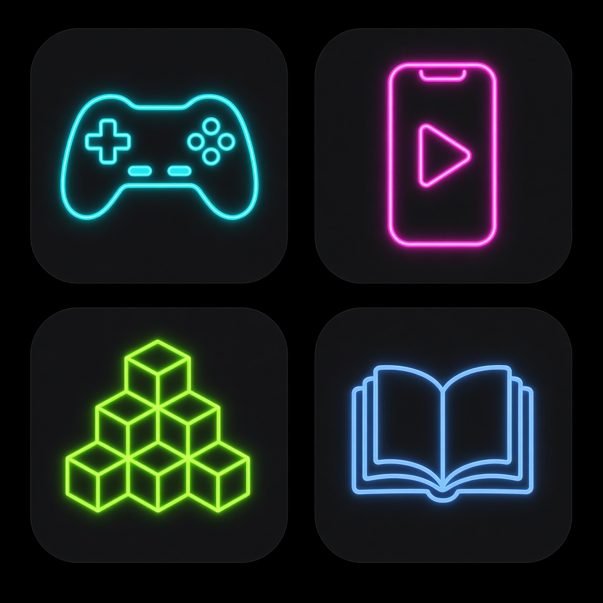

<div align="center">



<br/>

<a href="https://casgames.com.tr">
  
</a>
<a href="https://github.com/cengizhanas">
  
</a>


<br/><br/>

<a href="https://git.io/typing-svg">
  
</a>

</div>

---

## `01 / INTRO`

```text
CENGIZHAN AS
Software Engineer · Product Builder · Indie Studio

I build things people actually open again.

→ neon arcade / casual mobile games
→ Flutter products with sharp UX
→ Go backends that stay boring (in a good way)
→ tooling, automation and local AI pipelines

Studio: CasGames  ·  Site: casgames.com.tr
```

<div align="center">
  
</div>

## `02 / HOW I BUILD`

Kısa seans. Yüksek tempo. Temiz his.  
Same energy whether it’s a game loop or an API boundary.

<div align="center">
  
</div>

| Mode | Feel | What it means |
|:--|:--|:--|
| **Arcade** | Touch & go | Instant feedback, reflex loops, fun first |
| **Systems** | Quiet power | Clear services, data, queues, observability |
| **Polish** | Clean hit | Motion, typography, controls that feel right |

## `03 / CASGAMES`

I run **[CasGames](https://casgames.com.tr)** — arcade-souled casual mobile games.  
Fast to open. Easy to play. Hard to put down.

<div align="center">
  
  <br/>
  
</div>

<table>
<tr>
<td width="33%" valign="top">

### `Frenzy Stack` 🟢 Live
**Stack blocks. Reach the top!**

Dokun, bırak, hayatta kal. Timing + reflexes, Frenzy Mode, skins, global leaderboard.

`Casual` `iOS` `Android`

[Oyun sayfası](https://casgames.com.tr) · App Store · Google Play

</td>
<td width="33%" valign="top">

### `Void Hunter` 🟣 Soon
**Survive the rift. Hunt together.**

Avcı seç, cephaneyi geliştir, kaleyi güçlendir — co-op aksiyon.

`Action` `Co-op` `Coming soon`

[Bekleme listesi](https://casgames.com.tr)

</td>
<td width="33%" valign="top">

### `Das Library` 🔵 Live
**Read. Track. Build the habit.**

Oyun değil — dijital kütüphane & günlük: kitaplar, seriler, notlar.

`Reading` `iOS` `Android`

[casgames.com.tr](https://casgames.com.tr)

</td>
</tr>
</table>

## `04 / WHAT ELSE I SHIP`

<table>
<tr>
<td width="50%" valign="top">

### `Mobile Products`
Apps where product logic matters as much as pixels.

- multi-profile / personalized flows
- notification-heavy experiences
- community & creator mechanics
- quiz / challenge / map concepts

`Flutter` `Product UX` `Mobile architecture`

</td>
<td width="50%" valign="top">

### `Backend Systems`
The layer I go deepest on.

- REST & gRPC
- authN / authZ
- PostgreSQL · Redis
- queues & events
- modular services + observability

`Go` `Rust` `PostgreSQL` `Redis`

</td>
</tr>
<tr>
<td width="50%" valign="top">

### `Developer Tools`
Friction-killers for how builders work.

- IDE → task manager bridges
- AI-assisted task expansion
- multi-workspace routing
- automation around context

`Extensions` `Integrations` `DX`

</td>
<td width="50%" valign="top">

### `Automation & Local AI`
Systems that research, verify, generate and self-repair.

- multi-agent pipelines
- verification loops
- local model orchestration
- media / content automation

`Agents` `Local AI` `Pipelines`

</td>
</tr>
</table>

## `05 / STACK`

<div align="center">


</div>

```yaml
core:
  product: [Flutter, Dart, Firebase]
  backend: [Go, Rust, PostgreSQL, Redis]
  realtime: [gRPC, WebSocket, queues]
  ops: [Docker, Nginx, GitHub Actions, AWS]
  craft: [motion, UX polish, arcade feel]
```

## `06 / PLAYBOOK`

```text
01. Start from the feeling the user should get in 3 seconds.
02. Design the loop before the stack.
03. Keep backend boundaries boring and clear.
04. Automate anything that should not stay manual.
05. Treat failures as part of the architecture.
06. Prefer systems you can observe.
07. Use AI as a component — not a magic wand.
08. Ship complete products, not isolated demos.
```

## `07 / SIGNAL`

<div align="center">


</div>

## `08 / CONTRIBUTION SNAKE`

<div align="center">

<picture>
  <source
    media="(prefers-color-scheme: dark)"
    srcset="https://raw.githubusercontent.com/cengizhanas/cengizhanas/output/github-snake-dark.gif"
  />
  
</picture>

</div>

---

<div align="center">

### `CENGIZHAN AS`

**Arcade energy. Production grade.**

`Games` · `Mobile` · `Backend` · `Tools` · `Local AI`

<br/>

[](https://casgames.com.tr)
[](https://github.com/cengizhanas)
[](mailto:cengizhanas.ca@gmail.com)

<br/>

**Ship fast. Shine bright.**

</div>
