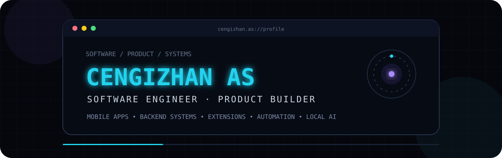
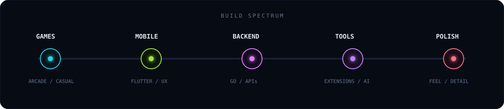

<div align="center">



<br/>

<a href="https://github.com/cengizhanas">
  
</a>


<br/><br/>

<a href="https://git.io/typing-svg">
  
</a>

</div>

---

## `01 / ABOUT`

```text
CENGIZHAN AS

Software Engineer · Product Builder

I design and build software products across multiple layers:

→ mobile applications
→ backend systems
→ IDE / developer extensions
→ automation workflows
→ local AI pipelines
→ product architecture

My strongest engineering direction is backend development with Go,
but I enjoy building the complete product around the backend —
from mobile UX and integrations to automation and infrastructure.
```

<div align="center">
  
</div>

## `02 / WHAT I BUILD`

<table>
<tr>
<td width="50%" valign="top">

### `Mobile Products`

I like building apps where product logic matters as much as UI.

**Examples of product directions**
- multi-profile / personalized apps
- community-driven products
- challenge / quiz experiences
- map-based interaction concepts
- notification-heavy applications
- creator & sharing workflows

`Flutter` `Mobile Architecture` `Product UX`

</td>
<td width="50%" valign="top">

### `Backend Systems`

Backend is the engineering layer I want to go deepest on.

**Focus**
- REST & gRPC APIs
- authentication / authorization
- PostgreSQL & Redis
- queues / event-driven flows
- observability
- modular architecture
- testing & deployment

`Go` `Rust` `PostgreSQL` `Redis`

</td>
</tr>

<tr>
<td width="50%" valign="top">

### `Extensions & Developer Tools`

I enjoy tools that remove friction from how developers work.

**Examples**
- IDE → task manager integrations
- AI-assisted task expansion
- multi-workspace routing
- extension configuration flows
- automation around developer context

`Extensions` `Integrations` `Developer Tooling`

</td>
<td width="50%" valign="top">

### `Automation & Local AI`

I like systems that can research, verify, generate and repair their own workflow.

**Focus**
- multi-agent pipelines
- independent verification
- self-repair / retry loops
- local model orchestration
- media / content automation
- structured task generation

`Local AI` `Agents` `Automation`

</td>
</tr>
</table>

## `03 / PRODUCT DNA`

```yaml
product_engineering:
  mobile:
    - Flutter
    - interaction-heavy apps
    - notifications
    - profiles
    - community systems
    - creator flows

  backend:
    primary: Go
    secondary: Rust
    database: PostgreSQL
    cache: Redis
    messaging:
      - RabbitMQ
      - Kafka
    api:
      - REST
      - gRPC

  developer_tools:
    - IDE extensions
    - API integrations
    - workflow automation
    - task orchestration

  ai_systems:
    - local LLM workflows
    - agent pipelines
    - verification
    - retry / repair loops

  infrastructure:
    - Docker
    - Docker Compose
    - Linux
    - Nginx
    - GitHub Actions
    - AWS

  observability:
    - Prometheus
    - Grafana
    - OpenTelemetry
```

## `04 / SELECTED PRODUCT DIRECTIONS`

> These represent systems, products and concepts I have designed, explored or implemented at different stages.

<table>
<tr>
<td width="50%" valign="top">

### `IDE → Task Extension`

An extension concept for converting IDE context into structured tasks.

**System ideas**
- Cursor / Gemini compatible workflow
- AI-generated task detail
- ClickUp / task manager integration
- workspace / list / section routing
- multiple API integrations
- configurable defaults

`extension` `AI` `developer tooling`

</td>
<td width="50%" valign="top">

### `Autonomous Media Pipeline`

A full local-first automated content system.

**Pipeline**
- research
- fact verification
- script generation
- visual matching
- TTS / alignment
- rendering
- QC
- retry / self-repair

`local AI` `multi-agent` `automation`

</td>
</tr>

<tr>
<td width="50%" valign="top">

### `Multi-Faith Mobile Platform`

A profile-driven mobile product with religion/tradition-specific behavior.

**System ideas**
- personalized notification engine
- worship / practice tracking
- AI Q&A layer
- community discussions
- translation / moderation
- premium feature boundaries

`mobile` `backend` `notifications`

</td>
<td width="50%" valign="top">

### `Social Quiz Platform`

An interaction-heavy mobile/web product built around tests, challenges and sharing.

**System ideas**
- discovery & trends
- categories
- quiz flows
- challenge / battle modes
- creator studio
- profiles & activity
- social sharing

`Flutter` `social product` `content`

</td>
</tr>

<tr>
<td width="50%" valign="top">

### `Map-Based Game Concepts`

Real-world / map-driven multiplayer interaction concepts.

**System ideas**
- create nearby games
- join live sessions
- local game discovery
- multiplayer state
- proximity-driven interactions

`maps` `realtime` `mobile`

</td>
<td width="50%" valign="top">

### `Personal Memory Products`

Consumer-app concepts around notes, moments and personal collections.

**System ideas**
- multiple notebooks
- screenshot capture workflows
- quick-entry UX
- personal activity history
- lightweight organization

`mobile` `consumer apps` `UX`

</td>
</tr>
</table>

## `05 / CORE STACK`

<div align="center">


</div>

## `06 / HOW I THINK`

```text
01. Start from the actual user problem.
02. Design the product flow before overengineering the stack.
03. Keep backend boundaries clear.
04. Automate work that should not stay manual.
05. Treat failures as part of the architecture.
06. Prefer observable systems.
07. Use AI as a system component, not as magic.
08. Build complete products, not isolated demos.
```

## `07 / GITHUB SIGNAL`

<div align="center">


</div>

<div align="center">
  
</div>

## `08 / CONTRIBUTION FLOW`

<picture>
  <source
    media="(prefers-color-scheme: dark)"
    srcset="https://raw.githubusercontent.com/cengizhanas/cengizhanas/output/github-snake-dark.svg"
  />
  <source
    media="(prefers-color-scheme: light)"
    srcset="https://raw.githubusercontent.com/cengizhanas/cengizhanas/output/github-snake.svg"
  />
  
</picture>

---

<div align="center">

### `CENGIZHAN AS`

**Software Engineer · Product Builder**

`Mobile Apps` · `Backend Systems` · `Extensions` · `Automation` · `Local AI`

<br/>

[](https://github.com/cengizhanas)

<!-- Enable when ready:
[](__LINKEDIN_URL__)
[](__PORTFOLIO_URL__)
-->

</div>
